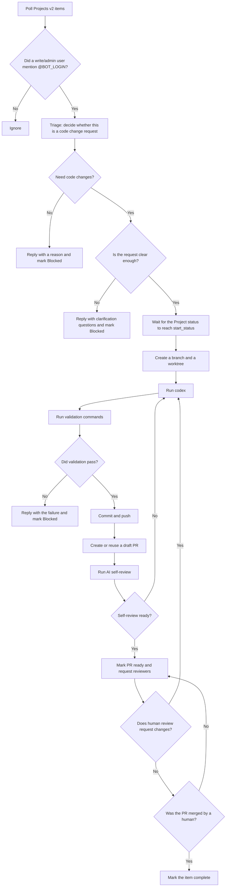

# Autono

Autono is an autonomous coding bot. It watches GitHub Projects v2 items and issue / PR discussion, checks whether a task mentions the configured bot login, triages the request, runs `codex` for repository changes, executes validation commands, creates or updates a PR, and marks the item complete after a human merge.

Its user-facing workflow is simple:

- Submit a request
- Clarify requirements if needed
- Review the code
- Merge the PR

Autono handles the implementation steps in the middle, so the user can stay in GitHub for requirements, progress, and code review.

If you want the full Chinese documentation, see [`docs/README.zh-CN.md`](docs/README.zh-CN.md).

It is designed for teams that want:

- Multiple repositories managed from GitHub Projects
- A manual start gate before implementation begins
- Local state for recovery, idempotency, and retry
- Review-driven iteration before merge

If you want to understand the flow first, start with the workflow diagram below.

## Workflow



## What It Does

Autono first confirms the request, then moves through implementation phases.

1. **Discover the task**
   - Reads Projects v2 items
   - Reads the linked issue or PR discussion
   - Checks whether the configured bot login was mentioned

2. **Triage**
   - Asks `codex` whether the request is a code change
   - If the request is discussion, documentation, or another non-implementation task, Autono replies and marks the item `Blocked`
   - If the request is unclear, Autono replies with questions and marks the item `Blocked`
   - If the request is clear, Autono stores `AwaitingStart` and keeps watching new comments for follow-up replies before implementation starts

3. **Wait for the start gate**
   - Autono waits until the Project `status` field matches `workflow.start_status`
   - Example: if `start_status = "In Progress"`, the item starts only after you set the Project status to `In Progress`

4. **Implement**
   - Creates a branch and a worktree
   - Runs `codex`
   - Gives `codex` a read-only reference to the base checkout for context
   - Runs the configured validation commands
   - If validation fails, the failure output is fed back to `codex` for another fix attempt

5. **Review**
   - After validation passes, Autono commits and pushes the changes
   - It creates or reuses a draft PR
   - It runs an AI self-review, posts the self-review result to the PR, and fixes findings before human review
   - Once self-review passes, it posts `Review Ready`, marks the PR ready for review, and requests reviewers
   - If human review requests changes, Autono continues on the same branch and worktree, replies to active review threads, resolves them after the fix lands, and repeats the self-review gate before asking humans again

6. **Complete**
   - After a human merges the PR, Autono marks the item complete

## Blocked and Recovery

`Blocked` means the current flow is paused.

It usually means one of these:

- The request belongs to discussion, documentation, or another non-implementation task
- The request needs more information
- Validation failed after retry attempts
- The repository made no changes

To recover:

1. Add more information in the same thread
2. Mention the bot again
3. Autono runs triage again
4. If the request is clear now, it moves back to `AwaitingStart`
5. Then it waits for `workflow.start_status` again

Example:

- You submit a request, but the requirements are incomplete, so Autono marks it `Blocked`
- You add implementation details and mention the bot again
- Autono triages the updated discussion
- If the task is now actionable, it leaves `Blocked` and resumes the normal flow

## Configuration

Use a TOML file such as [`autono.example.toml`](autono.example.toml).

### Top-level settings

- `bot_login`: GitHub login name of the bot
- `poll_interval_secs`: polling interval
- `worktrees_root`: worktree root directory
- `state_path`: SQLite state file path
- `[github]`: GitHub API and token source settings
- `[[targets]]`: one or more repository / project targets

### Required per-target fields

- `owner` / `repo`: repository name
- `checkout_path`: local checkout path
- `base_branch`: base branch for the work branch
- `project_id` or `project_number`: Projects v2 target
- `[targets.workflow]`: Project status field and status names
- `[targets.review]`: PR reviewers
- `[targets.commands]`: `codex` and validation commands

### Workflow settings

- `status_field`: Project status field name
- `triaged_status`: status written after triage when appropriate
- `start_status`: manual start gate
- `review_status`: status written after PR creation
- `done_status`: completion status
- `blocked_status`: blocked status

### Command settings

- `codex`: command used to run `codex`, for example `["codex"]`
- `test`: validation commands, executed in order, for example `["cargo", "test"]`
- `max_fix_attempts`: how many repair attempts are allowed after a failed validation

## Example

`autono.example.toml`:

```toml
bot_login = "your-bot-login"
poll_interval_secs = 60
worktrees_root = "/srv/autono/worktrees"
state_path = "/srv/autono/state.sqlite3"

[github]
token_source = "gh"
api_url = "https://api.github.com"
graphql_url = "https://api.github.com/graphql"

[[targets]]
owner = "example"
repo = "service-a"
checkout_path = "/srv/autono/checkouts/service-a"
base_branch = "main"
project_owner = "example"
project_number = 12

[targets.workflow]
status_field = "Status"
triaged_status = "Triaged"
start_status = "In Progress"
review_status = "In Review"
done_status = "Done"
blocked_status = "Blocked"

[targets.review]
reviewers = ["alice", "bob"]

[targets.commands]
codex = ["codex", "exec", "--sandbox", "danger-full-access", "--ask-for-approval", "never"]
test = ["cargo", "test"]
max_fix_attempts = 3
```

### Reading the example

- `bot_login = "your-bot-login"`: replace this with the bot account used for mentions
- `start_status = "In Progress"`: the Project item starts only after the status is set to this value
- `test = ["cargo", "test"]`: Autono runs `cargo test` after implementation
- `max_fix_attempts = 3`: after a failed validation, Autono may ask `codex` to repair the code up to 3 times

## Quick Start

```sh
autono run --config autono.toml
```

Run continuously and poll according to the configured interval.

```sh
autono once --config autono.toml
```

Run one polling pass. Useful for local debugging.

```sh
autono inspect item --config autono.toml --repo owner/name --item-id ITEM_ID
```

Inspect the stored state for a single item.

```sh
autono recover --config autono.toml --repo owner/name --item-id ITEM_ID
```

Recover or rebuild the local state for a single item.

## GitHub Token

Autono supports two token sources.

### `token_source = "gh"`

Uses the `gh` login session. The session needs repository and Projects permissions:

```sh
gh auth refresh -s repo -s read:project -s project
```

### `token_source = "env"`

Uses the `GITHUB_TOKEN` environment variable.

Required steps:

- Set `GITHUB_TOKEN`
- Change `token_source` to `env`

## Local State

Autono stores local SQLite state for:

- Managed items
- Branch, worktree, and PR metadata
- Last processed comment and review IDs
- Recovery after interruption

The default state file name is `autono.sqlite3`. If `state_path` is unset, Autono stores it under `worktrees_root`.

## Design Constraints

This repository uses an application-oriented layout:

- The crate exposes only a small public surface
- Most implementation details stay inside the crate
- Business logic is organized around stateful objects
- Time uses `time::OffsetDateTime`
- Library errors use `thiserror`
- `anyhow` stays in the binary entrypoint only
