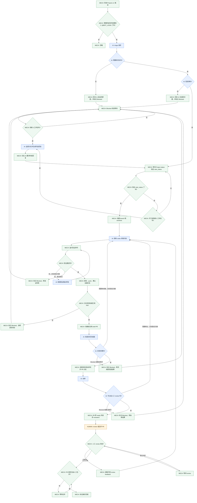

# Autono

Autono 是一个自动编程机器人。它持续轮询 GitHub Projects v2 条目和 issue / PR 讨论，识别需要代码改动的任务，调用 `codex` 修改仓库，运行验证命令，创建 PR，并在人工合并后把项目条目标记为完成。

它的核心卖点是：

- 用户只需要提需求
- 用户只需要补充信息、确认方案、审代码
- 用户不用手动打开 IDE

它适合这种场景：

- 同一个 GitHub 账号要管理多个仓库
- 任务先进入 Project，再由人工决定何时开工
- 代码修改、验证、PR、review 都要保留完整记录
- 需要本地状态来支持恢复和重试

如果你只想看它怎么工作，先看下面的 workflow。

## Workflow



## 它会做什么

Autono 会先确认任务内容，再进入实现流程。它的流程分成几步：

1. **发现任务**
   - 读取 Projects v2 里的条目
   - 读取条目关联的 issue 或 PR 讨论
   - 判断是否出现了配置里的 `bot_login`

2. **初筛 triage**
   - 让 `codex` 判断是否需要代码改动
   - 如果属于需求讨论、文档说明或其他非实现任务，就回复说明并标记为 `Blocked`
   - 如果信息不够，就回复需要补充的问题，并标记为 `Blocked`
   - 如果信息够了，就进入 `AwaitingStart`，并持续监看后续评论，只有需要时才继续回复

3. **等待开工**
   - Autono 会等待 Project 里的 `status` 字段变成配置中的 `workflow.start_status`
   - 例如配置是 `start_status = "In Progress"`，那你需要把条目状态改成 `In Progress`
   - 这是人工放行信号

4. **开始实现**
   - 创建 branch 和 worktree
   - 在 worktree 里调用 `codex`
   - 给 `codex` 一个只读的 base checkout 作为上下文参考
   - 运行配置中的验证命令
   - 验证失败时，会把错误输出交回给 `codex` 继续修

5. **提交和 Review**
   - 验证通过后，自动提交并 push
   - 创建或复用 draft PR
   - 检查实现是否完整，收尾本地改动，并确认远端 PR 分支已经同步到本地分支
   - 先运行 AI 自审，把自审结果发到 PR，并在进入人工 review 前自行修复发现的问题
   - 自审通过后，会发出 `Review Ready`，把 PR 转为 ready，并请求 reviewers
   - 如果人工 review 要求修改，会继续在同一条工作线上迭代，并在修复后回复活跃 review 线程再 resolve，然后再次经过 AI 自审门禁

6. **完成**
   - PR 被人工合并后，Autono 将条目标记为完成

## Blocked 和恢复

`Blocked` 表示当前流程暂停。

它通常表示下面几种情况之一：

- 任务属于需求讨论、文档说明或其他非实现内容
- 任务信息不够，需要补充
- 验证失败，已经重试过
- 没有产生任何 repository 变更

恢复方式是：

1. 人工在原线程继续补充信息
2. 再 @ 一次 bot
3. Autono 重新 triage
4. 如果现在信息足够，它会回到 `AwaitingStart`
5. 然后继续等 `workflow.start_status`

例子：

- 你先发了一个需求，但描述不完整，Autono 回复并标记 `Blocked`
- 你补了一段接口说明，再 @ bot
- Autono 重新判断后发现现在已经能实施
- 它会重新进入等待开工的状态

## 配置

使用 TOML 配置文件，例如 [`autono.example.toml`](../autono.example.toml)。

### 顶层配置

- `bot_login`：bot 的 GitHub 登录名。Autono 会检查评论里是否出现这个账号
- `poll_interval_secs`：轮询间隔
- `worktrees_root`：worktree 根目录
- `state_path`：SQLite 状态文件路径
- `[github]`：GitHub API 与 token 来源
- `[[targets]]`：一个或多个仓库 / Project 目标

### 每个 target 需要的字段

- `owner` / `repo`：仓库名
- `checkout_path`：本地 checkout 路径
- `base_branch`：工作分支的 base branch
- `project_id` 或 `project_number`：Projects v2 目标
- `[targets.workflow]`：Project status 字段和状态名称
- `[targets.review]`：PR reviewers
- `[targets.commands]`：`codex` 和验证命令

### workflow 相关配置

- `status_field`：Project 里的状态字段名
- `triaged_status`：triage 完成后可选的状态
- `start_status`：开工门槛状态
- `review_status`：进入 review 后写回的状态
- `done_status`：完成状态
- `blocked_status`：阻塞状态

### commands 相关配置

- `codex`：调用 `codex` 的命令，例如 `["codex"]`
- `test`：验证命令，按顺序执行，例如 `["cargo", "test"]`
- `max_fix_attempts`：验证失败后允许的自动修复次数

## Example

`autono.example.toml` 长这样：

```toml
bot_login = "your-bot-login"
poll_interval_secs = 60
worktrees_root = "/srv/autono/worktrees"
state_path = "/srv/autono/state.sqlite3"

[github]
token_source = "gh"
api_url = "https://api.github.com"
graphql_url = "https://api.github.com/graphql"

[[targets]]
owner = "example"
repo = "service-a"
checkout_path = "/srv/autono/checkouts/service-a"
base_branch = "main"
project_owner = "example"
project_number = 12

[targets.workflow]
status_field = "Status"
triaged_status = "Triaged"
start_status = "In Progress"
review_status = "In Review"
done_status = "Done"
blocked_status = "Blocked"

[targets.review]
reviewers = ["alice", "bob"]

[targets.commands]
codex = ["codex", "exec", "--sandbox", "danger-full-access", "--ask-for-approval", "never"]
test = ["cargo", "test"]
max_fix_attempts = 3
```

### 这个例子怎么读

- `bot_login = "your-bot-login"`：把这里换成你实际的 bot 登录名
- `start_status = "In Progress"`：把 Project 状态改成这个值时，Autono 才会开始工作
- `test = ["cargo", "test"]`：每次改完代码后都会运行 `cargo test`
- `max_fix_attempts = 3`：测试失败后，最多再让 `codex` 尝试修 3 次

## 快速开始

```sh
autono run --config autono.toml
```

持续运行，按配置的轮询间隔检查项目。

```sh
autono once --config autono.toml
```

只运行一轮检查，适合本地调试。

```sh
autono inspect item --config autono.toml --repo owner/name --item-id ITEM_ID
```

查看某个 item 当前保存的状态。

```sh
autono recover --config autono.toml --repo owner/name --item-id ITEM_ID
```

重建或恢复某个 item 的本地状态。

## GitHub Token

Autono 支持两种 token 来源。

### `token_source = "gh"`

使用 `gh` 登录态。需要仓库和 Projects 权限：

```sh
gh auth refresh -s repo -s read:project -s project
```

### `token_source = "env"`

使用环境变量 `GITHUB_TOKEN`。

需要：

- 设置 `GITHUB_TOKEN`
- 把 `token_source` 改成 `env`

## 本地状态

Autono 会在本地保存一份 SQLite 状态，用来：

- 记录已经接手的 item
- 记录 branch、worktree 和 PR 信息
- 记录最后处理到哪个 comment / review
- 支持断点恢复和幂等执行

默认状态文件名是 `autono.sqlite3`。如果不显式配置 `state_path`，它会放在 `worktrees_root` 下。

## 设计约束

这个项目保持应用程序风格：

- crate 只暴露少量入口类型
- 大部分实现细节都在 crate 内部
- 业务逻辑围绕对象和状态组织
- 时间统一使用 `time::OffsetDateTime`
- 库层错误使用 `thiserror`
- `anyhow` 只留在二进制入口
